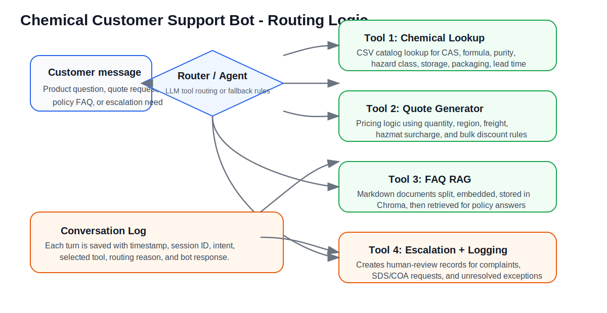
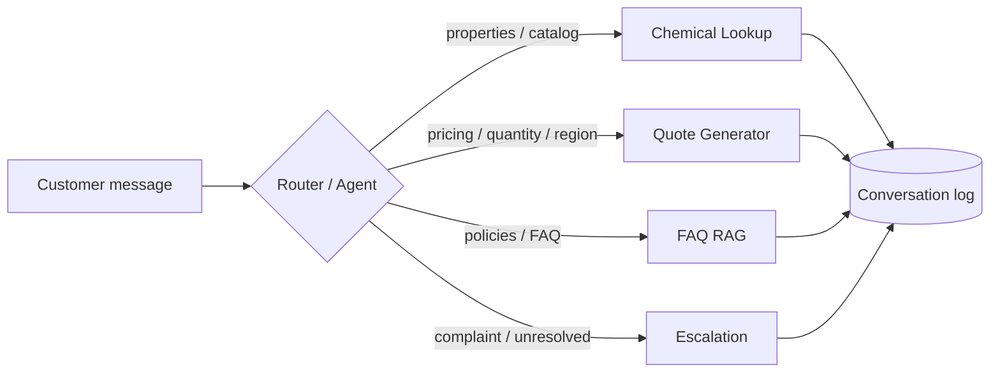

# Chemical Customer Support Bot

LangChain-based customer support chatbot for chemical product inquiries, preliminary quotes, policy questions, and human escalation.

**GitHub repo:** `https://github.com/nemo-mei/chemical-chatbot.git`  
**Live demo:** `nemomei39/chemical-customer-support-bot`

## Overview

This project is a LangChain-based customer support chatbot for the chemical industry. It helps customers look up chemical properties, answer common business-policy questions, generate preliminary price quotes, and escalate complex cases to a human representative.

## The Problem

Chemical suppliers often receive repetitive inbound questions that consume sales and marketing time: customers ask for storage conditions, packaging details, MOQ, lead time, payment terms, hazardous shipping options, and rough order pricing. Many of these requests follow the same pattern, but staff still have to check catalog spreadsheets, policy documents, and pricing rules manually. This bot is designed to reduce that repetitive workload by routing each customer request to the right information source and returning a structured answer quickly, while still escalating exceptions that should stay with a human expert.

## How It Works



The bot routes customer messages across four actions:

1. **Chemical Lookup** uses `data/chemicals.csv` to return catalog facts such as CAS number, purity, hazard class, storage conditions, packaging, and lead time.
2. **Quote Generator** combines `data/chemicals.csv` with `data/pricing_rules.csv` to estimate a preliminary quote using quantity, region, shipping rules, and bulk discounts.
3. **FAQ RAG** reads markdown policy documents from `docs/`, chunks them, and answers questions about MOQ, payment terms, returns, and shipping. When embeddings or API access are unavailable, it falls back to deterministic local retrieval.
4. **Escalation + Logging** records complaints, damaged shipments, SDS/COA requests, or unresolved cases for human follow-up and saves conversation logs for later analysis.

### Routing summary



## Tools and Data Sources

This project uses four routed tools/data sources:

- `chemicals.csv` for structured chemical catalog lookup
- `pricing_rules.csv` for quote logic
- Markdown policy documents in `docs/` for FAQ retrieval
- `escalations.csv` and `conversations.csv` for human handoff and conversation logging

## Key Findings / What I Learned

A multi-tool chatbot is much more reliable when each task is grounded in a narrow data source instead of asking the model to answer from memory. Structured tasks like price estimation and property lookup were better handled by deterministic Python tools than by free-form prompting. That pushed the design toward a router-plus-tools architecture rather than a single prompt trying to do everything.

The second major lesson was that production-style demos need graceful fallback behavior. Optional dependencies, vector store setup, and API keys can all fail in deployment. Building a fallback path for FAQ retrieval and intent routing made the app more resilient and easier to demo locally, while still preserving the LangChain path when Gemini and embeddings are configured correctly.

## Sample Conversations

These sample exchanges were captured from local demo runs and recorded in `logs/demo_conversations.csv`.

### 1) Chemical lookup
**User:** What is the storage condition for acetone?  
**Bot:** Acetone (CAS 67-64-1) is a flammable solvent typically stored in a tightly closed container in a cool, well-ventilated flammables cabinet away from heat and ignition sources.

### 2) Quote request
**User:** Give me a quote for 250 kg ethanol shipped to California.  
**Bot:** Quote status: OK. Product: Ethanol. Quantity: 250 kg. Estimated total: $645.00. Lead time: 5 business days. This is a preliminary quote for planning purposes.

### 3) FAQ / policy question
**User:** What is your minimum order quantity?  
**Bot:** Our standard minimum order quantity depends on the product, but many catalog items start at 25 kg. Small-pack evaluation quantities may be available for selected products.

### 4) Escalation
**User:** I need a human representative for a damaged shipment complaint.  
**Bot:** Your request has been escalated to a human representative. Priority: High. A sales or support specialist should follow up with you shortly.

## How to Run

### Local setup

```bash
git clone YOUR_GITHUB_REPO_URL
cd chemical-customer-support-bot
python -m venv .venv
source .venv/bin/activate
pip install -r requirements.txt
cp .env.example .env
```

Add your Gemini API key to `.env`:

```bash
GOOGLE_API_KEY=your_key_here
GOOGLE_GENAI_MODEL=your_preferred_model_name
```

Run the app:

```bash
python app_langchain.py
```

### Notes

- If `GOOGLE_API_KEY` is not configured, the app still runs in fallback mode.
- FAQ retrieval uses a true RAG path when the optional LangChain/Chroma stack is available; otherwise it falls back to local keyword retrieval.

## Repository Structure

```text
chemical-customer-support-bot/
├── app.py
├── app_langchain.py
├── langchain_bot.py
├── router.py
├── requirements.txt
├── data/
│   ├── chemicals.csv
│   └── pricing_rules.csv
├── docs/
│   ├── FAQ.md
│   ├── payment_terms.md
│   ├── return_policy.md
│   ├── shipping_policy.md
│   └── escalation_guidelines.md
├── tools/
│   ├── chemical_lookup.py
│   ├── quote_generator.py
│   ├── faq_rag.py
│   └── escalation.py
├── logs/
│   ├── conversations.csv
│   ├── escalations.csv
│   └── demo_conversations.csv
├── assets/
│   ├── routing_logic.svg
│   └── routing_logic.mmd
└── tests/
```

## Deployment

A step-by-step Hugging Face Spaces checklist is included in [`DEPLOY_TO_HF_SPACES.md`](DEPLOY_TO_HF_SPACES.md). After deployment, replace both placeholder URLs at the top of this README.

## Who Would Care

This project would be useful to chemical suppliers, distributors, and inside sales or marketing teams that spend time answering repetitive customer questions. It could also help operations or customer-support teams triage requests faster, reduce response times for routine inquiries, and decide which conversations need human escalation immediately.

## Reflection

I set out to build a LangChain chatbot that solved a real business problem rather than a generic AI demo. What actually happened was that the project became an exercise in system design: structured catalog lookup, deterministic pricing logic, retrieval-based FAQ answering, and escalation workflows each needed a different implementation style. The result was stronger than a single-prompt chatbot because each tool could be validated independently and improved without rewriting the whole app.

If I extended this project further, I would connect it to a real product database, add customer-specific pricing tiers, and make escalation tickets flow into a CRM or help desk system instead of a CSV file. I would also evaluate the intent router more systematically by labeling user messages and measuring routing accuracy. That would make the project closer to a production support workflow and give better evidence of business value.
